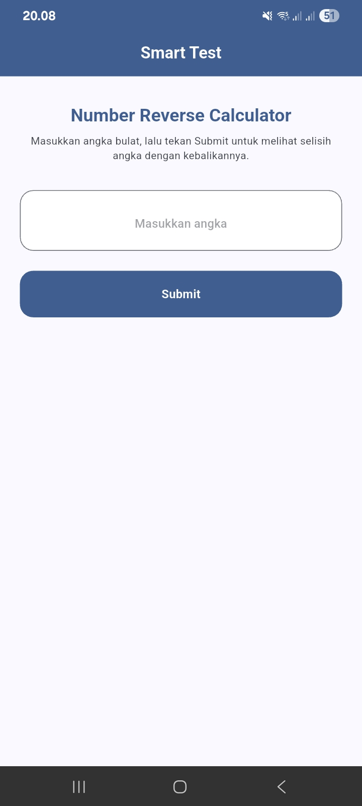
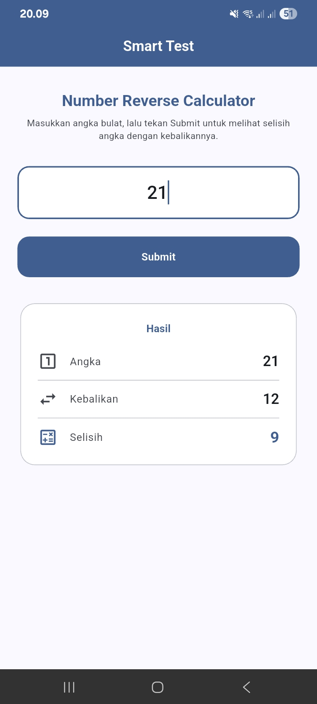
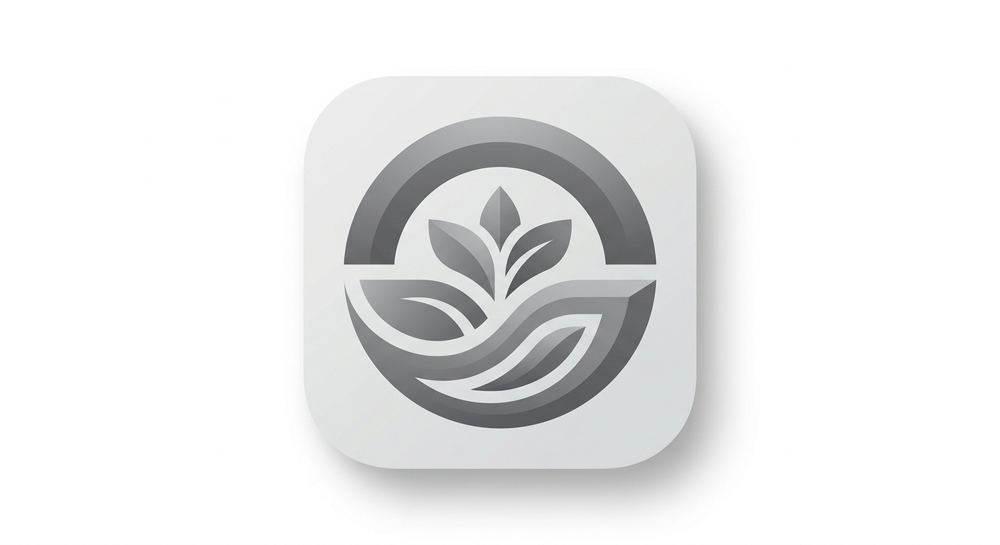

# Smart Test — Number Reverse Calculator

Aplikasi mobile Flutter yang menghitung selisih absolut antara sebuah bilangan bulat dengan kebalikan digitnya. Dibuat sebagai bagian dari **Technical Test PT SMART Tbk**.

## Fitur

- Input hanya menerima angka bulat (huruf, titik, koma, dan simbol lainnya otomatis di-strip secara real-time)
- Menghitung kebalikan digit dari angka yang diinput (contoh: `30` → `3`, bukan `03`)
- Menampilkan selisih absolut antara angka asli dan kebalikannya
- Hasil selalu positif

## Screenshot

<p align="center">
  
  &nbsp;&nbsp;
  
</p>

## Contoh Penggunaan

| Input            | Kebalikan | Selisih |
| ---------------- | --------- | ------- |
| 21               | 12        | 9       |
| 30               | 3         | 27      |
| 1.2 (menjadi 12) | 21        | 9       |

## Struktur Project

```
lib/
├── main.dart                          # Entry point & UI utama
└── utils/
    ├── calculator.dart                # Logic reverse number & kalkulasi selisih
    └── digits_only_formatter.dart     # Custom TextInputFormatter (digits only)
```

## Arsitektur & Keputusan Teknis

- **State Management**: `setState` — dipilih karena state terisolasi di satu screen dengan kompleksitas rendah. Tidak perlu Provider/Bloc untuk satu form sederhana.
- **Input Filtering**: Custom `TextInputFormatter` dengan regex `[^0-9]` — meng-strip semua karakter non-digit secara real-time saat user mengetik. Ini memenuhi requirement bahwa input `1.2` atau `1,2` langsung muncul sebagai `12`.
- **Reverse Logic**: Konversi string → reverse → `int.parse()` — otomatis menghapus leading zeros (contoh: `03` → `3`).
- **Material 3**: Menggunakan `useMaterial3: true` dengan `ColorScheme.fromSeed` untuk palette warna yang konsisten dan modern.

## Cara Build APK

```bash
# Install dependencies
flutter pub get

# Jalankan test
flutter test

# Build release APK
flutter build apk --release
```

File APK tersedia di: `build/app/outputs/flutter-apk/app-release.apk`

### Install ke Device

```bash
# Via ADB
adb install build/app/outputs/flutter-apk/app-release.apk
```

Atau transfer file APK ke device Android dan install manual.

## Requirements

- Flutter SDK >= 3.9.2
- Android SDK dengan minSdk 21 (Android 5.0+)

---

## Ikon Aplikasi

### Konsep Desain — PT SMART Tbk (Technical Test)

<p align="center">
  
</p>

#### 1. Filosofi Utama: Sinergi Agribisnis dan Teknologi

Desain ikon ini dirancang untuk merepresentasikan transformasi digital di dalam ekosistem agribisnis. Tujuannya adalah mempertahankan identitas korporat PT SMART Tbk sekaligus memberikan kesan inovatif, modern, dan fungsional yang diharapkan dari sebuah produk digital (mobile app).

#### 2. Elemen Visual dan Maknanya

- **Kurva Melengkung (Lingkaran Luar)** — Mengambil inspirasi dari bentuk brand identity grup perusahaan. Kurva ini membingkai elemen di dalamnya, melambangkan perlindungan, keberlanjutan, dan ekosistem perusahaan yang solid dan terintegrasi.

- **Tunas dan Daun Geometris (Di Tengah)** — Merepresentasikan inti bisnis PT SMART Tbk di bidang agribisnis dan kelapa sawit. Bentuk daun sengaja dibuat tajam, simetris, dan geometris untuk menggeser kesan tradisional menjadi lebih berorientasi pada teknologi, akurasi, dan pertumbuhan digital.

- **Garis Aliran Dinamis (Bagian Bawah)** — Melambangkan aliran data, proses digitalisasi, dan fondasi teknologi yang menopang pertumbuhan perusahaan.

#### 3. Pemilihan Warna (Grayscale / Abu-abu)

Penggunaan palet monochromatic grayscale diterapkan secara sengaja dengan dua alasan teknis:

- **Fase Development** — Warna abu-abu merepresentasikan status proyek yang saat ini sedang dalam fase technical test (proses rekrutmen) atau prototype. Ini berfungsi layaknya wireframe atau skeleton UI, di mana fokus utama saat ini adalah pada fungsionalitas, arsitektur kode, dan struktur aplikasi, sebelum warna korporat (merah) disuntikkan pada tahap final.

- **Netralitas UI** — Secara estetika, warna abu-abu memberikan kesan profesional, premium, dan industrial.

#### 4. Pendekatan Modern Mobile UI/UX

Ikon ini didesain agar sangat selaras dengan standar arsitektur UI/UX mobile-first masa kini. Penggunaan gradien halus dan efek kedalaman (subtle depth/bevel) memberikan sentuhan modern yang premium. Desain ini akan tetap terlihat tajam, proporsional, dan legible (mudah dibaca) baik ketika dirender pada layar beresolusi tinggi maupun saat diskalakan menjadi ikon kecil di app drawer perangkat mobile.
